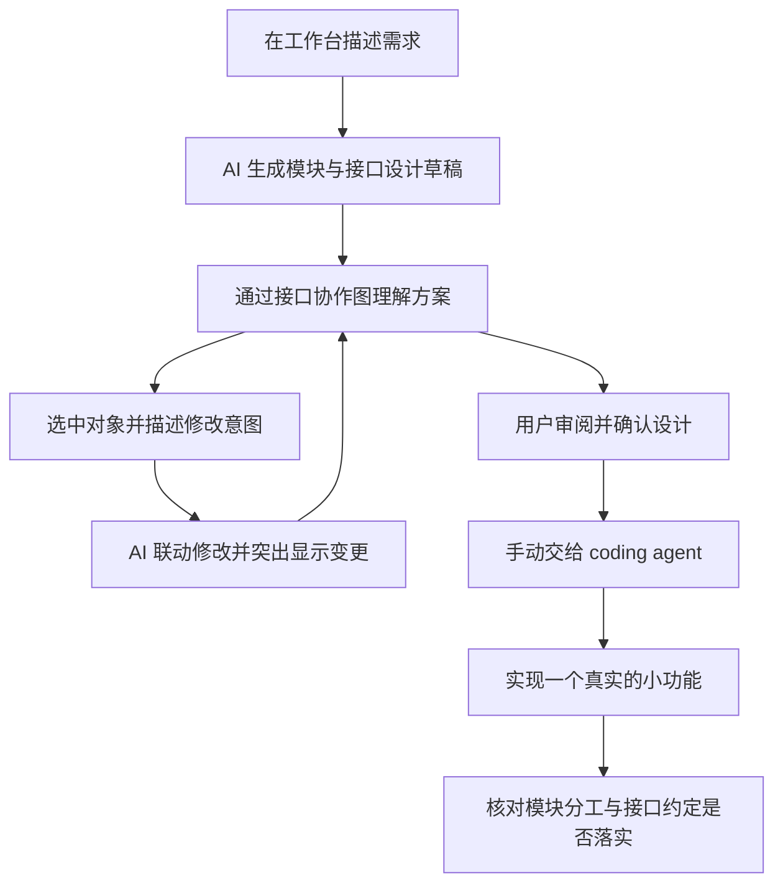

# 独立图形工作台实现依据

> 2026-09-21 决策更新：本文中由工作台承接需求对话、模型生成与调整，以及外部 agent 集成后置的安排，已由 [ADR-0002](docs/adr/0002-external-coding-agent-orchestration.md) 取代。后续由外部 coding agent 主导流程并调用本程序；图形编辑、变更审阅、用户确认及确定性检查继续保留。下文保存当时的实现依据，代码迁移尚未实施。

确认日期：2026-09-20  
状态：用户已确认产品方向。本文保留立项时的目标与差距作为实现依据；2026-09-20 的实现及验证进展见[独立工作台实现与验收](docs/standalone-workbench.md)。

2026-09-21 补充：已有 Go 项目从代码开始的首次接入，按[已有项目初次分析实现依据](已有项目初次分析实现依据.md)完善。该文补充本文件的新项目设计流程，范围与验收目标已确认，实现及验证边界见[初次分析实现与验收](docs/initial-analysis.md)。

先做独立工作台，验证用户能否通过图形理解、调整 AI 生成的模块与接口设计，并将确认后的方案用于实际开发。需求输入、设计生成、调整和确认都在工作台内完成；接入 coding agent 的 skill 后置。

本文取代[产品设计](产品设计.md)和[使用方式与交互](使用方式与交互.md)中关于设计入口、图形交互方式及首轮成功标准的旧约定。未涉及的产品职责、用户确认权和检查边界继续沿用。独立工作台承接设计流程的原因见 [ADR-0001](docs/adr/0001-use-standalone-design-workbench.md)。

## 已确认的决策

| 决策点 | 结论 | 理由或直接影响 |
| --- | --- | --- |
| 验证顺序 | 先独立验证，再考虑 skill 集成 | 先验证设计过程及产物的效果，首轮使用不依赖外部工具集成 |
| 设计入口 | 独立的本地浏览器工作台 | 用户在同一工作台中描述需求、查看生成结果、调整并确认设计 |
| 图形深度 | 接口协作图 | 展示模块职责、接口归属，以及哪个模块使用另一个模块的哪个接口 |
| 主要修改方式 | 选中图上对象，用自然语言表达意图，由 AI 联动修改 | 拆分或合并模块时，职责、接口和协作关系可以一起调整，减少逐项编辑 |
| 变更审阅 | 在图上突出显示变更，用户接受或继续调整；简单手动编辑作为补充 | 用户能看清 AI 改了什么，并保留设计决定权 |
| 实现依据 | 用户确认后的设计 | AI 起草和修改草稿，用户定稿；接受一次草稿修改不等于确认整个设计版本 |
| 首轮成功标准 | 完成设计流程，并交给 coding agent 实现一个真实的小功能 | 同时验证设计是否便于理解、调整，以及模块分工和接口约定能否落实 |
| 首轮交接方式 | 手动交接已确认的设计文件 | 可以验证实际实现，不以安装 skill 或自动交接作为前提 |

## 目标使用流程

以下为立项时确定的目标流程。当前操作说明见 [README](README.md)，实现证据见[验收记录](docs/standalone-workbench.md)。

例如，用户描述“做一个支持下单、支付和退款的系统”，工作台生成初稿。图上能看到订单模块通过支付模块的“申请退款”接口发起退款。

用户选中支付模块，输入“把退款拆成独立模块”。AI 在草稿中联动调整模块职责、退款接口归属及相关协作连线，突出显示受影响的内容。用户可以接受这次修改、继续提出意见，或补充手动编辑。最终审阅并确认整个设计后，再交给 coding agent 实现。

这里的“图形交互”以可选择、可调整的接口协作图为主要工作区域。需求和修改意图仍可用文字表达，详细说明按需展开。

## 图中需要表达的内容

| 内容 | 用户需要看懂或调整的事情 |
| --- | --- |
| 模块 | 每个模块负责什么，职责边界在哪里 |
| 接口 | 模块对外提供什么能力，接口属于哪个模块 |
| 接口协作 | 哪个模块使用哪个具体接口，例如“订单 → 支付的申请退款接口” |
| 接口详情 | 点选后查看能力说明、必要的输入输出含义和错误语义 |
| 设计变更 | 本次 AI 修改影响了哪些模块、接口归属和协作关系 |

接口继续表达对外能力，不限定为 Go 的 `interface` 类型，也不要求用户逐字段定义代码参数和结构体。模块内部实现交给外部编程工具。

接口协作关系与禁止依赖规则需要分别表达。当前画布的连线来自 `forbidden_dependencies`，表示禁止某个方向的直接包引用，不能把这些数据直接解释为接口协作关系。新增协作关系的数据结构和展示方式需要在实现时设计。

本次没有把接口协作图改成调用方白名单。沿用原有检查边界：未画出的关系不自动成为确定性违规，Go 包导入检查也不等于运行时接口调用检查。首轮核对接口协作是否落实时，需要结合实现代码审阅，不能只凭依赖检查通过下结论。

## 沿用的产品边界

- 本产品负责模块与接口设计、设计保存与确认，以及所支持范围内的架构检查。代码实现、修复、功能测试和业务验收由外部工具及开发流程负责。
- AI 生成和修改的是设计草稿。用户确认后，设计才成为实现与检查的基准；不能为迁就代码而自动改写已确认设计。
- 继续区分草稿、已确认版本、画布布局和代码检查结果。布局调整和扫描观察不能自动改变设计约束。
- 继续保留已有的项目隔离、版本冲突检测、未保存编辑保护和历史记录。后续 AI 修改也需要遵守这些边界。
- 程序能够确定的违规与模型提出的语义问题分别展示，语义结论仍需用户核查。

## 当前实现与目标之间的差距

以下现状于 2026-09-20 实施前对照源码核查，保留为立项基线。表中的待修改内容不代表当前状态，完成情况见[实现与验收](docs/standalone-workbench.md)。

| 部分 | 当前实现 | 后续需要完成的内容 |
| --- | --- | --- |
| 工作台入口 | 已支持启动、项目选择、手动创建模块和导入设计；见 [index.html](workbench/web/index.html) | 在工作台内提供需求输入和设计生成入口 |
| AI 设计流程 | 当前 [HTTP 服务](workbench/server.go)提供草稿、确认和检查接口，没有需求生成设计或选中对象后调用 AI 修改的流程 | 承接需求、所选对象和当前设计上下文，返回可审阅的设计修改；模型接入方式待定 |
| 设计模型 | [模型](design/model.go)和 [Schema](design/design.schema.json)保存模块、接口和禁止依赖规则，没有模块使用具体接口的协作关系 | 新增可保存、校验和导出的协作关系，并确定旧设计文件及历史版本的兼容方式 |
| 画布与详情 | [app.js](workbench/web/app.js)展示模块卡片、接口摘要和模块详情，连线表示禁止依赖 | 展示接口归属和具体协作关系，支持选中相关对象并查看接口详情 |
| 修改与审阅 | 已有表单编辑，以及确认前相对当前基准的文字差异；没有 AI 修改后的图形变更审阅 | 支持围绕所选对象发出修改意图、联动修改及突出显示变更，用户可接受或继续调整 |
| 保存与交接 | 已有 JSON 导出、草稿、确认快照、历史和独立布局；见 [store](store/store.go) | 扩展设计内容后保持保存、确认及导出完整，交给外部实现的版本必须是用户确认的版本 |
| 实现核对 | 已有 Go 直接依赖检查及外部语义审查协议；见 [README](README.md) | 用真实设计和实际实现核对本轮目标，记录检查范围、语义待确认项及人工核对结果 |

实施前的[核心用户旅程](docs/core-user-journeys.md)仅覆盖原有手动编辑、保存、同步和检查能力。其既有证据不能代替 AI 生成设计、接口协作图或真实开发效果的单独验证。

## 首轮验收

选择一个真实的小需求，完成下列流程。具体需求在执行验证时选定；前文退款拆分仅用于说明交互。

1. **生成初稿**：用户在工作台描述需求，通过真实 AI 调用得到模块与接口方案，并在图中查看模块职责、接口归属和接口协作。
2. **完成实质性调整**：用户选中对象，用自然语言提出一次影响设计内容的修改，例如拆分模块、迁移接口或调整协作关系。图中能看见相关变更，用户能接受或继续调整。
3. **确认设计**：用户审阅并确认最终版本，保存或导出的设计能够保留图中表达的模块、接口与协作关系，且能区分草稿和确认版本。
4. **交给外部实现**：手动将已确认设计交给 coding agent，完成一个真实的小功能。这一步不要求安装 skill 或自动同步外部对话。
5. **核对落实情况**：结合现有检查能力和代码审阅，核对模块分工及接口约定能否落实，记录设计需要补充、实现发生偏离或无法判断的地方。业务功能由原开发流程验证。

验收时保留需求文本、关键修改意图、修改前后的图形或设计差异、确认版本、对应实现位置和核对结果。固定模型响应可以用于程序回归，但不能替代本轮真实 AI 与外部实现的效果验证。

本轮通过，表示设计交互和一次实际实现具备初步可行性。长期架构控制、持续迭代收益，以及真实模型的误报和漏报，仍需后续验证。

## 后置事项与尚未确定的实现选择

skill 安装、与外部对话同步选中内容、自动交接设计、任务结束后自动检查及自动修复，留到独立验证之后考虑，不作为本轮验收前提。

立项时，模型供应商与接入方式、画布技术、协作关系的具体字段及版本兼容策略、AI 修改的提交协议尚未确定。实施中用户指定使用环境变量配置的 OpenAI 兼容接口；其余技术选择及兼容边界见[实现说明](docs/standalone-workbench.md)，不将实现选择记作用户指定的要求。

实施时先以本文件的目标流程和首轮验收为依据，再确定具体数据结构和调用协议；同时保持已有存储、确认和检查行为的边界。
